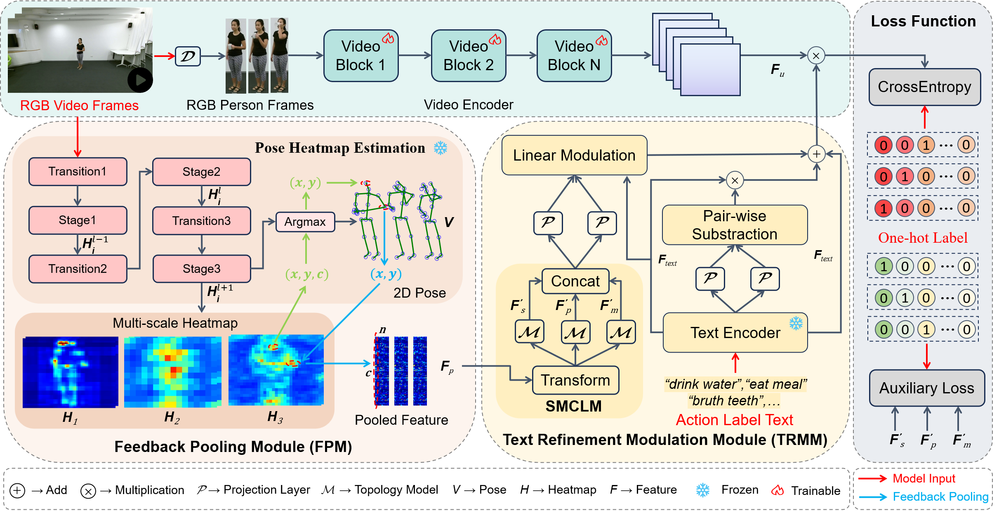
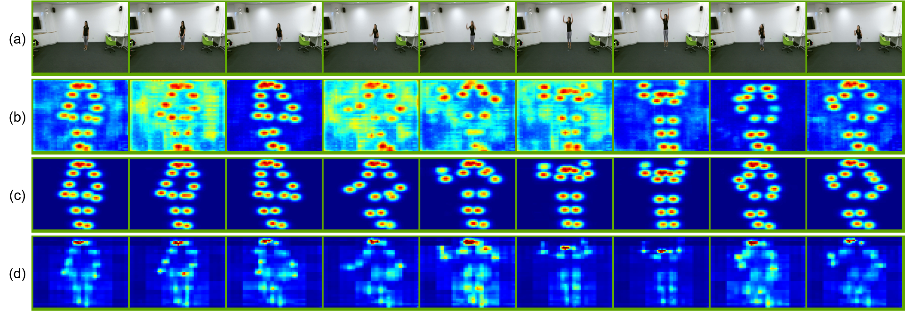
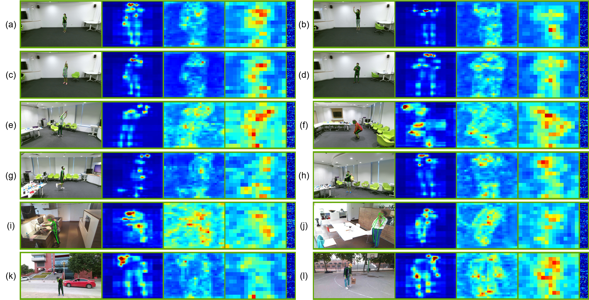

<p align="center">
  <h1 align="center">Heatmap Pooling for Action Recognition from RGB Videos</h1>
  <p align="center">
    <a href="https://www.ece.pku.edu.cn/info/1046/2596.htm">Mengyuan Liu</a></sup>,
    <a href="https://liujf69.github.io/">Jinfu Liu</a></sup>,
    <a href="https://robot.tongji.edu.cn/info/1256/2363.htm">Yongkang Jiang</a></sup>,
    <a href="https://robot.tongji.edu.cn/info/1256/2083.htm">Bin He</a></sup>,
    <br>
    </sup> Peking University, DJI Technology Co., Ltd., TongJi University
  </p>
  <h2 align="center">IEEE Transactions on Pattern Analysis and Machine Intelligence <br> (TPAMI), 2026</h2>
  <h3 align="center"><a href="https://arxiv.org/abs/2512.03837">📄[Paper]</a> | <a href="https://github.com/liujf69/HPNet-Action">💻[Code]</a>  </h3> 
  <div align="center"></div>
</p>

<div align=center>

</div>

# Download Dataset
1. **NTU-RGB+D 60** dataset from [https://rose1.ntu.edu.sg/dataset/actionRecognition/](https://rose1.ntu.edu.sg/dataset/actionRecognition/)
2. **NTU-RGB+D 120** dataset from [https://rose1.ntu.edu.sg/dataset/actionRecognition/](https://rose1.ntu.edu.sg/dataset/actionRecognition/)
3. **Toyota-Smarthome** dataset from [https://project.inria.fr/toyotasmarthome/](https://project.inria.fr/toyotasmarthome/)
4. **UAV-Human** dataset from [https://github.com/sutdcv/UAV-Human?tab=readme-ov-file](https://github.com/sutdcv/UAV-Human?tab=readme-ov-file)

# Process Dataset
```bash
cd Process_data
```
1. Download pretrained weights from [Google](https://drive.google.com/file/d/1MtljnHRv9R6F1ixMfIS0nqvLDyL2fe8a/view?usp=sharing)
2. Unzip and move
```bash
unzip SimCC_Pose_weights.zip
mv SimCC_Pose_weights/hrnet_w32-36af842e.pth ./pretrained
mv SimCC_Pose_weights/pose_hrnet_w48_256x192_split2_sigma4.pth ./pretrained
mv SimCC_Pose_weights/yolov5m.pt ./pretrained
mv SimCC_Pose_weights/fast_res50_256x192.pth ./models/sppe
mv SimCC_Pose_weights/fast_res101_320x256.pth ./models/sppe
```
3. Extract person frames
```bash
python Etract_person_from_video_xxx.py --sample_name_path <your_sample_name_path> --video_path <your_video_path> --output_path <your_output_path> --device <your_device>

# Example
python Etract_person_from_video_ntu.py --sample_name_path ./sample_txt/test.txt --video_path ./data/videos --output_path ./output/Person_Frame_224 --device 0
```
4. Extract heatmap pooling feature
```bash
python Etract_person_from_video_xxx.py --sample_txt <your_sample_txt> --videos_path <videos_path> --save_path <your_save_path> --device <your_device>

# Example
python Etract_person_from_video_ntu.py --sample_txt ./sample_txt/test.txt --videos_path ./data/videos --save_path ./output/pooling_feature --device 0
```
<div align=center>


</div>

# Train
## Train HP-Net (1s)
```
CUDA_VISIBLE_DEVICES=1,2,3,4 python -m torch.distributed.launch --nproc_per_node=4 hp_main.py \
--config <your_config_path> \
--distributed True \
--accumulation-steps 4 \
--output <your_output_path>
--resume <your_pretrained_weight_path>
```
## Train Topology Model
```
cd Topology
python main.py \
--device <your_device_id> \
--config <your_config_path> 
```

# Test
## Test HP-Net (1s)
```
CUDA_VISIBLE_DEVICES=1,2,3,4 python -m torch.distributed.launch --master_port=25641 --nproc_per_node=4 hp_main.py \
--config <your_config_path> \
--resume <your_pretrained_weight_path> \
--output <your_output_path> \
--only_test True
```
## Test Topology Model
```
cd Topology
python main.py \
--device <your_device_id> \
--config <your_config_path> \
--weights <your_weight_path> \
--phase test 
```

## Ensemble
1. Ensemble one-stream (1s)
```bash
cd ensemble
python ensemble_1s \
--gpu1_Score <gpu1_Score_path> \
--gpu2_Score <gpu2_Score_path> \
--gpu3_Score <gpu3_Score_path> \
--gpu4_Score <gpu4_Score_path> \
--gpu1_Name <gpu1_Name_path> \
--gpu2_Name <gpu2_Name_path> \
--gpu3_Name <gpu3_Name_path> \
--gpu4_Name <gpu4_Name_path> \
--val_sample <val_sample_path> \
--benchmark <NTU60XSub, NTU60XView, NTU120XSub, NTU120XSet, Smarthome_CS, Smarthome_CV1, Smarthome_CV2>

# demo example:
python ensemble_1s.py \
--gpu1_Score ./Smarthome_CS/0_best_score.npy \
--gpu2_Score ./Smarthome_CS/1_best_score.npy \
--gpu3_Score ./Smarthome_CS/2_best_score.npy \
--gpu4_Score ./Smarthome_CS/3_best_score.npy \
--gpu1_Name ./Smarthome_CS/0_best_name.txt \
--gpu2_Name ./Smarthome_CS/1_best_name.txt \
--gpu3_Name ./Smarthome_CS/2_best_name.txt \
--gpu4_Name ./Smarthome_CS/3_best_name.txt \
--val_sample ./Smarthome_CS/test_CS.txt \
--benchmark Smarthome_CS
```
2. Ensemble multi-stream
```bash
cd ensemble
# set rate (x.x, x.x, x.x, x.x, x.x) # J B JM BM HP-Net
python ensemble \
--gpu1_Score <gpu1_Score_path> \
--gpu2_Score <gpu2_Score_path> \
--gpu3_Score <gpu3_Score_path> \
--gpu4_Score <gpu4_Score_path> \
--gpu1_Name <gpu1_Name_path> \
--gpu2_Name <gpu2_Name_path> \
--gpu3_Name <gpu3_Name_path> \
--gpu4_Name <gpu4_Name_path> \
--J_Score <J_Score_path> \
--B_Score <B_Score_path> \
--JM_Score <JM_Score_path> \
--BM_Score <BM_Score_path> \
--val_sample <val_sample_path> \
--benchmark <NTU60XSub, NTU60XView, NTU120XSub, NTU120XSet, Smarthome_CS, Smarthome_CV1, Smarthome_CV2>

# demo example:
# set rate (0.1, 0.1, 0.1, 0.1, 4.0) # HP-Net J B JM BM
python ensemble \
--gpu1_Score ./Smarthome_CV1/0_best_score.npy \
--gpu2_Score ./Smarthome_CV1/1_best_score.npy \
--gpu3_Score ./Smarthome_CV1/2_best_score.npy \
--gpu4_Score ./Smarthome_CV1/3_best_score.npy \
--gpu1_Name ./Smarthome_CV1/0_best_name.txt \
--gpu2_Name ./Smarthome_CV1/1_best_name.txt \
--gpu3_Name ./Smarthome_CV1/2_best_name.txt \
--gpu4_Name ./Smarthome_CV1/3_best_name.txt \
--J_Score ./Smarthome_CV1/J_epoch1_test_score.pkl \
--B_Score ./Smarthome_CV1/B_epoch1_test_score.pkl \
--JM_Score ./Smarthome_CV1/JM_epoch1_test_score.pkl \
--BM_Score ./Smarthome_CV1/BM_epoch1_test_score.pkl \
--val_sample ./Smarthome_CV1/test_CV1.txt \
--benchmark Smarthome_CV1
```

# Thanks
Our project is based on the [TD-GCN](https://github.com/liujf69/TD-GCN-Gesture), [CTR-GCN](https://github.com/Uason-Chen/CTR-GCN), [X-CLIP](https://github.com/microsoft/VideoX/tree/master/X-CLIP), [HR-Net](https://github.com/leoxiaobin/deep-high-resolution-net.pytorch), [SimCC](https://github.com/leeyegy/SimCC).

# Citation
```python
@ARTICLE{hpnet,
  author={Liu, Mengyuan and Liu, Jinfu and Jiang, Yongkang and He, bin},
  title={Heatmap Pooling for Action Recognition from RGB Videos}, 
  journal={IEEE Transactions on Pattern Analysis and Machine Intelligence (TPAMI)}, 
  year={2025}
}
```

# Contact
For any questions, feel free to contact: ```liujf69@gmail.com```
